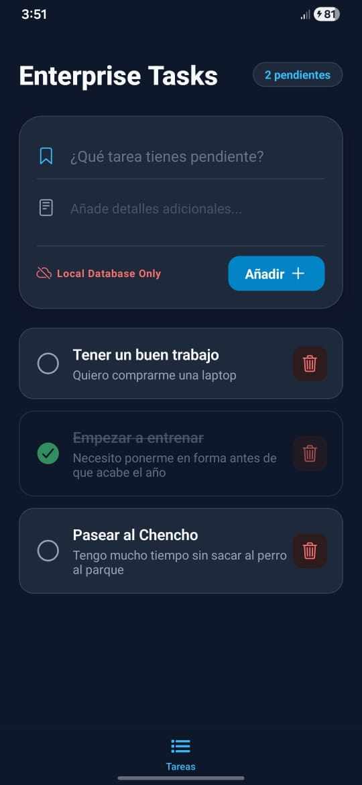
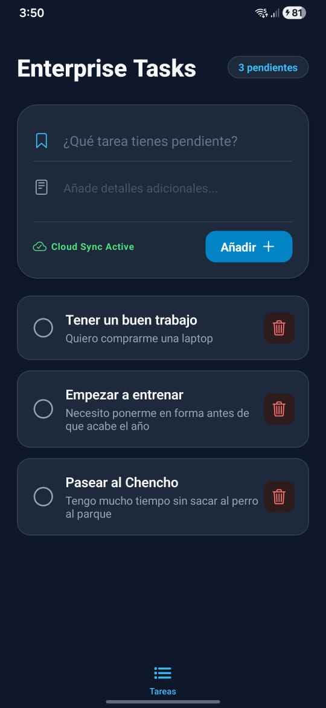

# The Enterprise Standards: Task Manager (Offline-First) 🚀

## 📱 App Preview

  
  
  
<i>Interfaz Dark Premium con arquitectura robusta y validación en tiempo real.</i>

---

## 📋 Objetivo del Proyecto

"The Enterprise Standards" es una aplicación de gestión de tareas de alto rendimiento diseñada bajo la filosofía **Offline-First**. El objetivo principal es demostrar la implementación de una arquitectura escalable, persistencia de datos relacionales en dispositivos móviles y la gestión de estados globales complejos con sincronización reactiva.

## 🏗️ Arquitectura: Clean Architecture

Para garantizar la mantenibilidad y el desacoplamiento, el proyecto se estructuró en tres capas principales:

1.  **Domain Layer:** Contiene las entidades (`Task.ts`) y la lógica pura de negocio. Es independiente de frameworks o librerías.
2.  **Data Layer:** Implementa el **Repository Pattern**. Gestiona la persistencia física mediante `expo-sqlite`.
3.  **Presentation Layer:** \* **State Management:** Zustand (Single Source of Truth).
    - **UI Components:** Dark Mode Pro, `React Hook Form` y `Zod`.

## 📡 Estrategia Offline-First

La aplicación implementa un sistema de sincronización inteligente:

- **Persistencia Local Inmediata:** CRUD directo en SQLite.
- **Detección de Conectividad:** Monitorización vía `@react-native-community/netinfo`.
- **Sync Engine:** Reconciliación automática de tareas `pending` al recuperar conexión.

## 🧪 Calidad y Testing

Se implementó una suite de pruebas unitarias robusta:

- **Store Testing:** Validación de flujos de estado en Zustand.
- **Validation Testing:** Integridad de datos con Zod.
- **Mocking Avanzado:** Aislamiento total de módulos nativos.

## 🛠️ Stack Tecnológico

- **Core:** React Native (Expo SDK 54) + TypeScript.
- **State:** Zustand.
- **Database:** Expo SQLite.
- **Forms & Validation:** React Hook Form + Zod.
- **Testing:** Jest + React Native Testing Library.

## 🚀 Instalación y Uso

1. Clonar el repositorio.
2. Instalar dependencias: `npm install`
3. Ejecutar tests: `npm test`
4. Iniciar app: `npx expo start`

---

**Desarrollado bajo estándares de ingeniería de software empresarial.**
